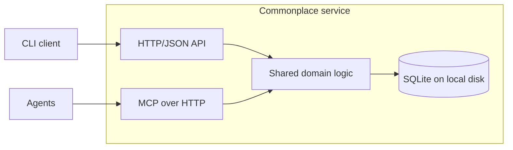

# Sarah Commonplace

**Status:** Network-service implementation baseline for v0.1, revised 2026-10-01; implementation not yet started

**Purpose:** Shared research notebook and coordination layer for cooperating AI agents and humans.

Use [IMPLEMENTATION.md](IMPLEMENTATION.md) for milestones, ownership, and release checks. Sections 22 and 24 define normative domain and network contracts respectively.

## 1. Summary

Sarah Commonplace is a small, self-hosted network service providing a shared notebook for teams of autonomous or semi-autonomous agents. CLI and MCP are two interfaces to the same service. It is designed for investigative work where agents form hypotheses, collect evidence, request replication, contradict one another, and coordinate experiments without forcing all collaboration through a single chat transcript.

The initial motivating use case is reverse engineering an old game with many agents operating independent debugger/emulator instances. The design must remain project-agnostic enough to support other research tasks such as binary analysis, software archaeology, debugging, experimental OS work, hardware experiments, or codebase investigations.

Commonplace is not an agent framework. It does not schedule models, decide what agents should think, or provide long-term autobiographical memory. It is a shared evidence and work-coordination substrate.

The core design is intentionally boring:

- one service process owning a SQLite database on its host's local disk
- WAL mode for concurrent readers/writers
- append-oriented evidence and activity history
- a small domain model: claims, evidence, requests, references, relationships, agents, activity
- an HTTP/JSON API and CLI client for humans and scripts
- an MCP over HTTP interface for agents, hosted in the same service
- pull-based activity cursors instead of a complex message broker

The intended scale for v0.1 is roughly 1-50 cooperating agents and up to millions of notebook records, not high-frequency telemetry. Large traces, screenshots, save states, binaries, and other bulky artifacts stay outside the database and are referenced from it.



Both adapters call the same core in the service process; the CLI calls the HTTP/JSON API over the network. There is no second domain implementation, client-owned database, or automatic direct-database fallback. Offline host maintenance is a separate, explicitly locked path. A local-only setup runs this same service on loopback without Internet access; remote clients reach it through TLS or an encrypted tunnel.

---

## 2. Goals

### 2.1 Primary goals

Commonplace SHALL:

1. Let an agent publish a concise hypothesis or observation as a **claim**.
2. Let any agent attach **supporting, contradicting, or neutral evidence** to a claim.
3. Let agents create **requests** for replication, falsification, tracing, inspection, comparison, or other work.
4. Let agents atomically claim requests so several workers do not accidentally perform the same task unless duplication is desired.
5. Preserve provenance: who wrote what, when, and in which agent/session.
6. Preserve history rather than silently overwriting prior conclusions.
7. Make recent changes cheap to poll so agents can coordinate asynchronously.
8. Provide full-text search plus structured filtering.
9. Permit references to external artifacts such as trace files, screenshots, commits, debugger locations, save states, URLs, or source files.
10. Work without Internet access or cloud services.
11. Be straightforward enough that a human can inspect the SQLite database directly when necessary.
12. Remain useful when only one human and one agent are using it.
13. Serve CLI and MCP clients on one or multiple machines through a single authoritative service.

### 2.2 Secondary goals

Commonplace SHOULD:

- be installable with minimal dependencies;
- have deterministic, machine-readable output modes;
- make it easy for a supervising agent to identify disputed claims, unreplicated findings, idle work, and newly important discoveries;
- support multiple projects in one database, although one-database-per-project is acceptable operationally;
- make backups straightforward: produce a consistent SQLite backup and separately preserve referenced artifacts;
- remain transport-independent internally so MCP is an adapter, not the core architecture.

---

## 3. Non-goals

For v0.1, Commonplace is NOT:

- a chat system;
- a general vector-memory product;
- a replacement for Git, Ghidra, issue trackers, or trace databases;
- a telemetry store for instruction-level traces;
- an orchestration engine that spawns or kills agents;
- a consensus algorithm;
- an authority that decides whether a claim is true;
- a distributed database across untrusted hosts;
- a binary artifact store.

A 700-million-row instruction trace belongs in the recorder/analysis system. Commonplace should contain a reference such as “trace X, rows Y-Z support claim 184,” not the trace itself.

---

## 4. Design principles

### 4.1 Evidence over chatter

The durable unit of collaboration is a claim, evidence item, request, or relationship, not an unstructured conversation.

### 4.2 Append rather than erase

Evidence content and its reproducibility assessment are immutable after creation in v0.1. If an observation proves wrong, add another evidence record or supersede the claim. Reference and tag attachments may be added with activity provenance; existing attachments are not removed or rewritten in v0.1.

### 4.3 Provisional knowledge is normal

The system must make it cheap to say “probably,” “needs replication,” and “this was wrong.” Reverse engineering progresses through useful guesses, not only finalized proofs.

### 4.4 Humans and agents are peers in provenance

A human researcher and an AI worker are both authors. The data model should not privilege either.

### 4.5 Self-hosted and inspectable

Notebook storage remains local to the service host. The complete logical state should be comprehensible with `sqlite3 commonplace.db` against a backup or during offline maintenance. Normal research clients access only the service API.

### 4.6 Coordination without a broker

v0.1 should use database transactions, leases, and a monotonically increasing activity sequence. A message queue can be added later if experience proves it necessary.

---

## 5. Core domain model

## 5.1 Project

A project is a namespace for research.

Fields:

- `id` integer primary key
- `slug` unique text, e.g. `uw1`
- `name` text
- `description` text nullable
- `created_at`
- `archived_at` nullable

A database SHALL support multiple projects. Every substantive record belongs to exactly one project. Agents and sessions are database-wide identities. Research operations always run in one explicit project context; v0.1 forbids cross-project links.

## 5.2 Agent

Represents a human, model worker, supervisor, or tool identity.

Fields:

- `id` text primary key, e.g. `luna-07`, `sarah`, `sol-supervisor`
- `display_name`
- `kind`: `human | agent | tool | unknown`
- `role` free text nullable
- `metadata_json`
- `created_at`
- `last_seen_at`

Clients supply an explicit agent ID through `--agent`, `COMMONPLACE_AGENT_ID`, or the MCP tool context. Distinct workers use distinct agent IDs; no shared anonymous writer identity is allowed. The configured service access token admits trusted clients; agent IDs are asserted research provenance, not separate authenticated user accounts. Section 15 defines this trust boundary.

## 5.3 Session

A session represents one run of an agent and prevents different incarnations of `luna-07` from becoming indistinguishable.

Fields:

- `id` UUID/text primary key
- `agent_id`
- `started_at`
- `ended_at` nullable
- `metadata_json`

Typical metadata may contain model name, host, emulator instance, git commit, or task label.

Research sessions are persistent service-side records. They are independent of TCP connections, MCP protocol sessions, CLI process lifetimes, and service restarts. Disconnecting or reinitializing an MCP connection never ends a research session or releases its leases.

## 5.4 Claim

A claim is a concise proposition worth preserving and testing.

Examples:

- “The word at `19A4:02D6` is current player HP.”
- “Routine `1C82:047A` applies melee damage.”
- “Overlay 7 is loaded after entering the automap.”
- “This function is a memcpy wrapper, not object lookup.”

Fields:

- `id` integer primary key
- `project_id`
- `author_agent_id`
- `author_session_id`
- `topic` short text, e.g. `inventory`, `combat`, `overlay`
- `statement` text
- `rationale` text nullable
- `confidence`: `tentative | likely | strong` nullable
- `status`: `open | supported | disputed | rejected | accepted | superseded`
- `priority`: `low | normal | high | critical`
- `created_at`
- `updated_at`
- `superseded_by_claim_id` nullable

Rules:

- `statement` is immutable after creation in normal operation.
- Meaningful correction creates a new claim and marks the old claim `superseded`.
- `status=accepted` means “accepted by this research team/workflow,” not mathematical truth.
- Confidence is explicitly subjective and must not substitute for evidence.

## 5.5 Evidence

Evidence records an observation relevant to a claim.

Fields:

- `id` integer primary key
- `project_id`
- `claim_id`
- `author_agent_id`
- `author_session_id`
- `polarity`: `supports | contradicts | neutral`
- `method`: short text, e.g. `watchpoint`, `single-step`, `static-analysis`, `trace-query`, `memory-edit`, `replication`
- `summary` text
- `procedure` text nullable
- `observation` text nullable
- `reproducibility`: `unreplicated | replicated | failed-replication | not-applicable`
- `replicates_evidence_id` nullable; identifies earlier evidence on the same claim tested by this observation
- `created_at`

Evidence is append-only.

Examples:

- supports: “Write watchpoint fired at `1C82:047A` immediately after rat attack; value changed 23 -> 20.”
- contradicts: “Changing `19A4:02D6` modifies mana display, not HP.”
- neutral: “Address changes during both damage and healing; semantic meaning remains uncertain.”

## 5.6 Request

A request is a unit of research work another agent can perform.

Fields:

- `id` integer primary key
- `project_id`
- `created_by_agent_id`
- `created_by_session_id`
- `claim_id` nullable
- `type`: free but conventionally one of `replicate | falsify | trace | inspect | compare | locate | explain | test | other`
- `title` short text
- `instructions` text
- `priority`: `low | normal | high | critical`
- `status`: `open | leased | completed | cancelled` (derived as specified in section 22.3)
- `desired_redundancy` integer default 1
- `created_at`
- `completed_at` nullable
- `cancelled_at` nullable
- `cancellation_note` nullable

Requests support intentional independent replication. `desired_redundancy=3` requires three completed contributions from three distinct agent IDs. Completed contributions plus active leases may never exceed three. Completion records work performed, including negative or inconclusive findings; it does not imply support for the claim. The immutable target must be 1–50.

## 5.7 Request lease

A lease is an atomic, expiring assignment of a request to an agent.

Fields:

- `id` integer primary key
- `request_id`
- `agent_id`
- `session_id`
- `leased_at`
- `expires_at`
- `released_at` nullable
- `release_note` nullable
- `completed_at` nullable (mutually exclusive with `released_at`)
- `completion_note` nullable
- `evidence_ids` / `resulting_claim_ids` via completion join tables

Rules:

- A worker obtains a lease in a single SQLite transaction.
- Completed contributions plus active leases may not exceed `desired_redundancy`.
- Expired leases do not block new workers.
- Only the owning agent/session may renew, release, or complete a lease.
- Completion attaches existing evidence/claim IDs; create those records with their own operations first. Section 22.3 defines expiry, completion, and retry behavior.

## 5.8 Relationship

Relationships connect claims to other claims.

Fields:

- `id`
- `project_id`
- `from_claim_id`
- `to_claim_id`
- `type`: `supports | contradicts | refines | depends-on | duplicates | related | supersedes`
- `author_agent_id`
- `author_session_id`
- `created_at`
- `note` nullable

This allows the notebook to become a lightweight knowledge graph without forcing graph-database infrastructure.

## 5.9 Reference

References point to artifacts or locations outside Commonplace.

Fields:

- `id`
- `project_id`
- `kind`
- `label` nullable
- `uri` nullable
- `value` nullable
- `metadata_json`
- `created_by_agent_id`
- `created_by_session_id`
- `created_at`

References may be attached to claims, evidence, and requests through join tables.

Recommended `kind` values include:

- `memory-address`
- `code-address`
- `symbol`
- `file`
- `source-location`
- `trace`
- `screenshot`
- `save-state`
- `git-commit`
- `url`
- `debugger-session`
- `other`

Examples:

```json
{
  "kind": "memory-address",
  "value": "19A4:02D6",
  "metadata": {
    "address_space": "x86-real-mode",
    "segment": 6564,
    "offset": 726,
    "linear": 105750
  }
}
```

```json
{
  "kind": "trace",
  "uri": "file:///lab/traces/run-042/",
  "metadata": {
    "instruction_start": 18342001,
    "instruction_end": 18342177
  }
}
```

Commonplace MUST NOT require understanding every reference kind. Unknown kinds remain valid opaque references.

Artifact locations are interpreted in their originating environment. A worker's `file:///...` URI does not refer to a path on the service or another worker. For host-local artifacts, record an `origin_host` in reference metadata; prefer a shared reachable URI or content hash when others need to reproduce the finding. Commonplace stores references but does not fetch, serve, synchronize, or grant access to artifacts.

## 5.10 Tag

Claims, evidence, and requests SHALL support tags. Normalize by trimming whitespace and Unicode case-folding; reject empty tags and deduplicate per entity. Tags are project-scoped. Attachments are additive in v0.1.

Examples: `inventory`, `player-state`, `needs-watchpoint`, `overlay-7`, `high-value`.

## 5.11 Activity

Every logical notebook/identity mutation produces one or more activity records in its transaction, with a database-global monotonically increasing sequence that is never reused. Rolled-back operations and no-op retries produce none. Activity does not recursively generate events. `project_id` is nullable only for database-wide identity lifecycle and backup events. Offline schema/restore maintenance is recorded separately in metadata.

Fields:

- `seq` integer primary key
- `project_id`
- `timestamp`
- `actor_agent_id`
- `actor_session_id`
- `event_type`
- `entity_type`
- `entity_id`
- `summary`
- `payload_json` nullable

Examples:

- `claim.created`
- `evidence.added`
- `claim.status_changed`
- `request.created`
- `request.leased`
- `request.completed`
- `relationship.created`

`seq` is the synchronization cursor for polling clients.

---

## 6. Core operations

The core library SHALL expose operations equivalent to the following. The service constructs an internal context containing its database handle, project, agent, and research session; it is omitted below for readability. The wire context contains notebook/generation and project/agent/session identifiers, never a database path or handle. IDs outside that project return `not_found`. HTTP/JSON, MCP, and CLI must preserve the same domain semantics.

### Setup and identity (service operations and offline maintenance)

```text
initialize_database(path) -> database_info  # offline host maintenance only
create_project(slug, name, description?) -> project
list_projects(limit?, cursor?) -> page
get_project(slug) -> project
set_project_archived(slug, archived, note) -> project
register_agent(id, display_name?, kind?, role?, metadata?) -> agent
start_session(agent_id, session_id, metadata?) -> session
end_session(session_id) -> session
get_context(context?) -> public_context  # wire operation/tool alias: context
database_info() -> database_info
backup_database(name?) -> backup_receipt  # service-owned backup directory
```

### Claims

```text
create_claim(topic, statement, rationale?, confidence?, priority?, tags?, refs?) -> claim
get_claim(id, include_evidence=true, include_relationships=true) -> claim_bundle
search_claims(query?, topic?, status?, tags?, author?, ref_kind?, limit?, cursor?) -> page
set_claim_status(id, status, note) -> claim
supersede_claim(old_id, new_claim_fields...) -> new_claim
```

### Evidence

```text
add_evidence(claim_id, polarity, method, summary, procedure?, observation?, reproducibility?, replicates_evidence_id?, refs?, tags?) -> evidence
list_evidence(claim_id, polarity?, method?, limit?, cursor?) -> page
```

### Requests

```text
create_request(type, title, instructions, claim_id?, priority?, desired_redundancy?, tags?, refs?) -> request
get_request(id) -> request_bundle
search_requests(query?, status?, type?, priority?, tags?, available_only?, limit?, cursor?) -> page
lease_request(request_id, lease_seconds=900) -> lease | conflict
lease_next_request(filters..., lease_seconds=900) -> lease | none
renew_lease(lease_id, lease_seconds=900) -> lease
release_lease(lease_id, note?) -> lease
complete_request(lease_id, note?, evidence_ids?, resulting_claim_ids?) -> lease_with_results
cancel_request(request_id, note) -> request
get_lease(lease_id) -> lease
list_leases(request_id?, agent_id?, limit?, cursor?) -> page
```

`lease_next_request` selects an available request by priority (`critical`, `high`, `normal`, `low`), then oldest `created_at`, then ID. It excludes requests already actively leased or completed by the same agent. `available_only` includes partly filled leased requests; it does not mean status must be `open`.

### Relationships

```text
relate_claims(from_claim_id, to_claim_id, type, note?) -> relationship
list_relationships(claim_id, limit?, cursor?) -> page
```

### Search and attachments

```text
search(query?, entity_types?, topic?, status?, tags?, author?, ref_kind?, limit?, cursor?) -> page
attach_reference(entity_type, entity_id, reference_fields_or_id) -> reference
add_tags(entity_type, entity_id, tags) -> tags
```

### Activity

```text
recent_activity(project, since_seq=0, limit=100, types?) -> {events, next_seq, has_more}
```

Clients store `next_seq` and poll periodically, using the lossless pagination rules in section 22.5.

### Summary / supervisor views

```text
project_snapshot(project) -> summary
```

The snapshot SHALL include:

- counts of open/supported/disputed claims;
- high-priority open requests;
- requests with expired leases;
- recently active agents;
- recently created claims;
- claims with contradicting evidence;
- accepted claims lacking independent replication;
- high-priority claims with no evidence;
- newest activity sequence.

This is designed for a supervising agent that periodically redirects a swarm.

---

## 7. Search

SQLite FTS5 SHALL index at least:

- claim statement and rationale;
- evidence summary/procedure/observation;
- request title/instructions;
- reference label/value;
- tags.

Structured filters are mandatory restrictions, not ranking hints. Within those filters, exact identifiers rank above textual relevance. Section 22.6 defines literal search behavior and result types.

Address-like strings such as `19A4:02D6`, `0x0277FF`, symbol names, and commit hashes must remain searchable verbatim.

Structured reference metadata may later support address-range queries. v0.1 does not need a universal address algebra.

---

## 8. Concurrency and transactions

SQLite SHALL be configured with:

```sql
PRAGMA journal_mode=WAL;
PRAGMA foreign_keys=ON;
PRAGMA busy_timeout=5000;
PRAGMA synchronous=FULL;
```

Verify WAL activation and set connection-specific pragmas on every connection. Use a supported SQLite runtime as specified in section 22.7.

Rules:

- individual notebook mutations should use short transactions;
- no network or model call may occur while holding a write transaction;
- lease acquisition, renewal, release, completion, and cancellation use `BEGIN IMMEDIATE` and check state after obtaining the write lock;
- activity insertion occurs in the same transaction as the mutation it records;
- schema migrations must be explicit and versioned;
- a client process dying must not leave a database lock; a service crash leaves SQLite to roll back uncommitted transactions and recover committed ones.

Only the service's storage layer opens the live database, using bounded independent connections on one host. Network clients may run elsewhere; they never mount or open the SQLite file. Live databases on NFS/SMB or cloud-sync folders are unsupported. WAL permits overlapping readers and a writer, but still serializes writers. Twelve-client process tests through the service must establish suitability for this workload. See the [SQLite WAL documentation](https://sqlite.org/wal.html).

---

## 9. MCP interface

The service exposes MCP using Streamable HTTP at `/mcp`. Its HTTP/JSON and MCP adapters are peers: both call the same application service in-process. MCP does not call the public HTTP/JSON endpoint internally. They share domain validation, access policy, research context, errors, and transaction handling; only protocol framing differs.

Required MCP tool names (the corresponding service operations are also available through HTTP/JSON):

```text
commonplace_create_claim
commonplace_get_claim
commonplace_search_claims
commonplace_set_claim_status
commonplace_supersede_claim
commonplace_add_evidence
commonplace_list_evidence
commonplace_create_request
commonplace_get_request
commonplace_search_requests
commonplace_lease_request
commonplace_lease_next
commonplace_renew_lease
commonplace_release_lease
commonplace_complete_request
commonplace_cancel_request
commonplace_get_lease
commonplace_list_leases
commonplace_relate_claims
commonplace_list_relationships
commonplace_search
commonplace_attach_reference
commonplace_add_tags
commonplace_recent_activity
commonplace_project_snapshot
commonplace_context
commonplace_create_project
commonplace_list_projects
commonplace_get_project
commonplace_set_project_archived
commonplace_register_agent
commonplace_start_session
commonplace_end_session
commonplace_database_info
commonplace_backup_database
```

Use the official MCP SDK for protocol negotiation, framing, and transport behavior. Implement the service handlers without tying persistent notebook state to a transport session. For v0.1, use stateless MCP transport handling where supported by the selected SDK. Any SDK transport session remains distinct from a Commonplace research session. See the [MCP transport specification](https://modelcontextprotocol.io/specification/2025-11-25/basic/transports).

Direct MCP clients configure the endpoint URL and access credential using their host's connection settings. Each tool takes a `context` object with `project`, `agent_id`, and `session_id` as applicable, plus its domain arguments and a required `operation_id` for mutations. Section 24.2 defines bootstrap exceptions. The host gives each worker its own agent/session identifiers, even when workers share an authenticated MCP connection. There is no connection-global current project/agent/session that one caller can overwrite for another.

Every MCP domain result uses the concise JSON envelope from section 22.4. `commonplace_context` returns the service's public identity, notebook ID, restore generation, API/schema versions, server time, and resolved project/agent/session; it never returns a database path or access token. Workers use it to check their destination and provenance before writing.

A stdio-to-MCP-HTTP bridge is optional for hosts lacking the required remote transport/header configuration. If supplied, it forwards to `/mcp`, takes URL/credential settings, and owns no storage or domain behavior. It must preserve research context and operation IDs. CLI access to the same service is the required v0.1 fallback; a stdio bridge is not a release prerequisite.

---

## 10. CLI

A human-facing CLI is a network client of the HTTP/JSON API. It mirrors the service operations and never opens the database for research work.

Examples:

These commands describe the required interface; they become runnable after implementation. Set `COMMONPLACE_URL`, `COMMONPLACE_TOKEN_FILE`, `COMMONPLACE_PROJECT`, and `COMMONPLACE_AGENT_ID` before research commands. Start a research session explicitly and retain `COMMONPLACE_SESSION_ID` for the worker's sequence of calls. Client settings use explicit flags before environment variables; there is no implicit destination service or project.

```bash
commonplace claim create \
  --topic combat \
  --confidence likely \
  "Word at 19A4:02D6 is player HP"

commonplace evidence add 184 \
  --supports \
  --method watchpoint \
  "Rat attack changed value 23 -> 20; writer 1C82:047A"

commonplace request create \
  --type replicate \
  --claim 184 \
  --redundancy 2 \
  --instructions "Use damage and healing; record both outcomes." \
  "Independently verify HP address"

commonplace request next --lease 15m
commonplace recent --since 920
commonplace search "19A4:02D6"
commonplace snapshot
```

CLI output modes:

- default human-readable
- `--json`
- optionally `--jsonl` for stream-like commands

The CLI SHALL also provide `project create|list|get|archive|unarchive`, `agent register`, `session start|end`, `context`, and every other network operation in section 6. `session start` generates a UUID on the client before sending it, unless `--session` is supplied; print the ID so subsequent invocations can reuse it. Required client flags/environment equivalents are:

| Flag | Environment | Meaning |
| --- | --- | --- |
| `--url` | `COMMONPLACE_URL` | Explicit service base URL; the client adds the versioned API path. |
| `--token-file` | `COMMONPLACE_TOKEN_FILE` | Local credential file; send its secret only in the Authorization header. |
| `--project` | `COMMONPLACE_PROJECT` | Project slug for research operations. |
| `--agent` | `COMMONPLACE_AGENT_ID` | Distinct worker/human provenance ID. |
| `--session` | `COMMONPLACE_SESSION_ID` | Persistent research session ID. |
| `--notebook-id` | `COMMONPLACE_NOTEBOOK_ID` | Expected notebook UUID obtained during setup. |
| `--generation` | `COMMONPLACE_GENERATION` | Expected restore generation retained with the session. |
| `--operation-id` | None | Retry identity for one mutation; generated once per CLI invocation if absent. |

Network `db info` reports public notebook/schema/runtime information. Network `db backup --name NAME` asks the service to write a backup in its configured backup directory and returns a receipt; NAME is a basename, not a client or server path. An omitted name is generated by the service. No endpoint accepts an arbitrary filesystem destination.

Host-only commands are `db init --db PATH`, `db migrate --db PATH`, `db restore --db PATH --from BACKUP`, and `serve --db PATH`. Init/migrate/restore require the service to be stopped and acquire its exclusive instance lock. They are not network operations or MCP tools. Initialization is explicit; serving an absent database fails. Restore refuses to overwrite an existing destination in v0.1.

`commonplace serve` owns service configuration: database path, listen address (default `127.0.0.1:8765`), token file, backup directory, and any TLS/allowed-origin settings. It has no fixed research project or agent. A client unable to connect reports an error and never creates a database or launches an implicit private service.

---

## 11. Example multi-agent workflow

1. `luna-03` searches memory while changing player HP.
2. It creates claim 184: “Word at `19A4:02D6` is player HP,” confidence `tentative`.
3. It adds evidence from observed value changes.
4. It creates a replication request with `desired_redundancy=2`.
5. `luna-07` and `luna-09` independently lease the request.
6. `luna-07` sets a write watchpoint, takes damage, adds evidence linked to the original observation, and completes its lease with the evidence ID. The request is not yet completed.
7. `luna-09` edits the value directly, observes the status panel, then heals, adds linked evidence, and completes its lease. The request now has two distinct completed contributions.
8. A supervisor sees claim 184 has independent support and changes status to `supported`.
9. Another agent later discovers the word is actually “current vitality” with semantics slightly different from HP. It creates claim 233 and supersedes claim 184 rather than rewriting it.
10. The full research trail remains queryable.

---

## 12. Repository layout

Required delivery layout:

```text
sarah-commonplace/
  README.md
  AGENTS.md
  docs/
    sarah-commonplace-SPEC.md
    IMPLEMENTATION.md
    contracts.md
    agent-setup.md
    deployment.md
  LICENSE
  pyproject.toml
  uv.lock
  .agents/
    skills/
      commonplace-worker/
        SKILL.md
      commonplace-supervisor/
        SKILL.md
  src/
    commonplace/
      __init__.py
      db.py
      schema.py
      migrations/
      models.py
      core.py
      errors.py
      search.py
      service.py
      http_api.py
      client.py
      auth.py
      maintenance.py
      cli.py
      mcp_server.py
  tests/
    test_claims.py
    test_evidence.py
    test_requests.py
    test_leases.py
    test_activity.py
    test_search.py
    test_concurrency.py
    test_service.py
    test_http_api.py
    test_auth.py
    test_network_recovery.py
    test_backup_restore.py
    test_mcp.py
    test_cli.py
    test_skills.py
  examples/
    uw1-agent-config.md
```

A Python implementation is selected for v0.1: Python 3.11+, `sqlite3`, a small ASGI service, HTTP client, thin CLI, and the official MCP Python SDK for Streamable HTTP. Select a compatible ASGI framework/server and HTTP client and lock tested versions during milestone 1. HTTP/JSON and MCP dispatch through the same application service. The storage format and domain semantics remain language-neutral. This tree is the required delivery layout, not a claim that these files already exist.

---

## 13. Schema management

Use a small integer schema version stored in a metadata table.

Requirements:

- every release that changes schema provides an upgrade migration;
- migrations run transactionally when SQLite permits;
- migrations are tested against at least the previous released schema;
- network `commonplace db info` reports the service's schema/runtime; host-only `commonplace db migrate --db PATH` performs maintenance;
- v0.1 has no automatic migration: incompatible schema versions prevent service readiness; migration runs with the daemon stopped and its exclusive instance lock held. Connected clients receive unavailability and cannot open the database themselves.

---

## 14. Reliability and auditability

Commonplace should favor durable, understandable failure modes.

Requirements:

- write operations either commit completely or not at all;
- all foreign keys are enforced;
- every mutation has activity provenance;
- timestamps are stored and returned as integer Unix milliseconds in UTC;
- malformed JSON metadata is rejected before insertion;
- lease expiry is evaluated from timestamps, not background timers;
- a crashed/disconnected agent leaves, at worst, an expiring lease; reconnecting does not silently renew or release it;
- a service restart retains committed sessions, leases, operation-ID results, and activity cursors; expiry uses the service host's current time;
- the service creates backups using SQLite's online backup API rather than copying a live WAL database naively. Offline restore establishes a new restore generation so old cursors and uncertain writes cannot be resumed silently.

Optional later feature: a hash chain over activity rows for tamper evidence. Not required for v0.1.

---

## 15. Security model

v0.1 serves one trusted research group. It is a private service, not a public multi-tenant product.

- Require a configured high-entropy bearer token for both HTTP/JSON and MCP, including loopback. Read it from an operator-managed file with restrictive permissions; no built-in/default secret. All holders are trusted collaborators with the same notebook privileges, including project setup and requesting service-managed backups.
- Agent/session IDs remain asserted research provenance. Core ownership checks prevent accidental cross-session actions, but this shared credential model does not isolate hostile group members. Per-user accounts, per-project authorization, and OAuth account flows are deferred.
- Bind to loopback by default. Non-loopback listeners require TLS. Remote access may instead use a TLS reverse proxy whose upstream is the loopback listener, or an authenticated encrypted tunnel to loopback. Clients verify certificates and reject plaintext remote service URLs; disabling TLS verification is not a supported mode.
- The private MCP access profile uses explicitly configured Authorization headers. It does not claim OAuth discovery interoperability. Hosts unable to supply that credential use the CLI or an optional stdio bridge; generic OAuth-only MCP client support is deferred. See the [MCP authorization specification](https://modelcontextprotocol.io/specification/2025-11-25/basic/authorization) for that separate authorization flow.
- Validate HTTP Host and any supplied Origin against configured allowlists on both interfaces; invalid values return 403. Default to no browser cross-origin access. Trust forwarding headers only from explicitly configured proxy peers. Never place credentials in URLs, tool arguments, notebook records, or logs, and never forward them across redirects.
- Artifact references are data, not instructions; the server must not automatically fetch arbitrary URLs or execute referenced files.
- File references should not imply permission to read those files.
- Neither network interface accepts SQL or a host path for execution, database selection, or filesystem access. File paths in artifact references remain opaque research data.
- Agent-supplied JSON metadata is limited to 64 KiB per object; each text field to 64 KiB UTF-8 and each input tag/reference/result-ID array to 200 items. Reject oversize inputs explicitly rather than silently truncating them.
- Cap the entire network request body at 4 MiB before JSON decoding, including streamed bodies; return a protocol-appropriate oversize error. Public health probes expose only health/readiness, not notebook contents or configuration.

---

## 16. Performance targets

These are sanity targets, not hard real-time guarantees.

On the service host, with a local SSD and loopback clients (remote network latency is additional):

- create claim/evidence/request: typically < 50 ms
- lease request: typically < 50 ms
- recent activity query for 100 rows: typically < 50 ms
- full-text search over 1 million notebook records: interactive, ideally < 500 ms for normal queries
- 12 simultaneous network clients performing human/model-rate writes without persistent busy failures

The database should be tested with at least 1 million synthetic records before calling v1 stable.

---

## 17. Testing requirements

### Unit tests

- claim lifecycle
- immutable evidence behavior
- status transitions
- relationships
- reference attachment
- FTS indexing
- activity generation

### Concurrency tests

- 12+ client processes repeatedly creating records through one running service, mixing CLI HTTP/JSON and MCP
- multiple workers racing to lease one request
- `desired_redundancy > 1`
- lease expiry and reacquisition
- client disconnect/crash and service-process crash simulation
- WAL readers while writers are active inside the service; separate-connection storage tests remain useful

### Migration tests

- fresh database creation
- upgrade from every released schema version
- migration failure leaves database recoverable

### HTTP/JSON and MCP contract tests

- every tool validates inputs
- stable JSON result shape
- conflicts represented explicitly
- configured agent/session provenance appears correctly
- the same operation has equivalent results and domain errors through both peer adapters
- authentication, invalid Origin/Host, request size limits, API version mismatch, and disabled direct-database fallback
- research session continuity across CLI/MCP use, reconnects, and service restarts
- a lost response after commit can be retried with the same operation ID through either interface without another mutation
- startup/readiness, exclusive owner lock, graceful shutdown, forced termination, and unsupported-runtime failure
- supported remote deployment with TLS or an encrypted tunnel, including certificate validation and unreachable-service errors

### End-to-end scenario

Automate the example claim -> replication request -> two leases -> evidence -> supported status workflow.

Also test wrong-owner and expired-lease completion, partial redundancy, same-agent reacquisition, cancellation races, duplicate retry after a lost response, cross-project links, session/agent mismatches, filtered activity pagination, punctuation-sensitive search, live service backups, restored-generation rejection, and real MCP over HTTP requests. Use independent network clients/processes for service races and separate database connections only within storage tests. Skill smoke tests must exercise worker and supervisor instructions with separate research identities against the same service.

---

## 18. Logging

Operational logging should be separate from notebook activity.

The service/CLI may log:

- startup configuration excluding secrets
- schema version
- database busy/retry events
- failed transactions
- MCP validation errors
- request correlation/operation IDs, protocol errors, and service lifecycle events

Do not duplicate notebook contents or credentials into logs by default. Remote errors contain stable codes and useful context, not Python tracebacks or server filesystem paths; detailed diagnostics stay in host logs.

---

## 19. v0.1 acceptance criteria

v0.1 is complete when:

1. A fresh database can be initialized, and one service starts with explicit configuration and readiness checks.
2. Multiple agents can create/search claims concurrently.
3. Evidence can support or contradict claims.
4. Requests can be created, atomically leased, renewed, released, and completed.
5. Redundant replication requests work correctly.
6. Every logical notebook/identity mutation appears in ordered activity history; offline maintenance has metadata records.
7. FTS5 search works across claims, evidence, and requests.
8. Claims/evidence/requests can carry external references and tags.
9. CLI supports the complete network workflow through HTTP/JSON without opening SQLite.
10. MCP over HTTP supports the same service operations and research semantics through its peer adapter.
11. Twelve-client process concurrency tests against one service pass in at least three consecutive runs.
12. Notebook state survives forced service/client termination without logical corruption or duplicate committed mutations on retry.
13. README includes a five-minute quick start and one multi-agent example.
14. Both Skills in section 23 are delivered, discoverable, and verified against the shipped CLI/MCP interfaces.
15. Multi-project isolation, session ownership, stale-lease rejection, completion retry, and filtered activity pagination tests pass.
16. A service-managed live backup restores with matching notebook data and passes integrity/foreign-key checks; restore changes the generation and invalidates old cursors/uncertain writes.
17. A clean installation runs the service, quick start, and both Skill workflows over loopback without Internet access after dependencies are installed.
18. Runtime checks reject unsupported SQLite/FTS5 or schema versions with actionable errors.
19. Authentication, TLS/tunnel deployment, protocol parity, bounded retries, and session continuity are verified with real network clients, including a client outside the service's network namespace or on another host.
20. A second daemon and offline maintenance commands cannot open the same database while its owner is running; shutdown/readiness/restart behavior passes the section 24 checks.

---

## 20. Deferred features

Do not block v0.1 on these:

- push notifications / WebSockets
- semantic/vector search
- embeddings
- automatic claim merging
- model-generated summaries stored as canonical truth
- web UI
- graph visualization
- remote multi-host replication
- per-user accounts, fine-grained authorization, and OAuth discovery (the required shared service credential is in v0.1)
- binary artifact storage
- debugger integration
- orchestration/scheduling
- automatic confidence scoring
- automatic consensus

The first likely post-v0.1 additions are:

1. lightweight web dashboard;
2. structured debugger/address reference helpers;
3. optional push notification transport;
4. configurable supervisor analyses beyond the required snapshot views;
5. artifact-directory conventions;
6. integrations with DOSBox/debugger tooling.

---

## 21. Guiding philosophy

Commonplace should make this interaction cheap:

```text
Agent A: I think X.
Agent B: I reproduced X.
Agent C: I found a counterexample.
Agent D: Here is the routine responsible.
Supervisor: Good. Two of you test the counterexample; one trace the caller.
```

It should not require the agents to maintain a giant shared prose document, reconstruct one another's chat history, or pretend every observation is certain before anyone can use it.

The tool succeeds when a swarm can accumulate a body of provisional but increasingly well-supported knowledge while preserving exactly how that knowledge was obtained.

---

## 22. v0.1 implementation contracts

### 22.1 Scope, identity, and integrity

- Every research operation takes one resolved project context. Use composite foreign keys or equivalent database constraints for all same-project links: evidence, supersession, relationships, request targets, completion results, references, and tag joins. Core validation adds useful errors; it does not replace database integrity.
- Every session/agent pair must match the session owner. Every domain mutation records non-null session provenance. Bootstrap `start_session` atomically creates its own actor session and uses that session for agent-registration/session-start events; other new mutations require an already open actor session. Stored-result replay and terminal no-op retries follow sections 22.3–22.4. Registration and session start are idempotent for matching existing records; conflicting identity metadata is rejected rather than overwritten silently.
- Research calls require a previously started session; missing context is an error, not an implicit new session per call. The caller generates a session UUID before `start_session` so a lost bootstrap response can be retried deterministically. The service atomically registers the agent if absent, creates the session, and audits both. CLI/MCP workers retain the same session across calls and transports. Explicit session closure releases active leases atomically. Network disconnect, MCP transport-session expiry, or service restart does not close the research session.
- Lease ownership is the exact `(agent_id, session_id)` pair. A restarted worker may explicitly resume that pair or wait for expiry and obtain a new lease. A shared agent ID alone grants no lease ownership.
- Agent `last_seen_at` is maintained on successful mutations without a separate heartbeat event. Reads do not update it. Project participation and recently active agents are computed from project-scoped activity.
- Project archive/unarchive is audited. Archived projects remain readable and reject research mutations. Administrative session closure may still release leases in archived projects. v0.1 exposes no destructive record deletion.
- Validate enums, positive IDs, JSON objects, nonblank required text, and numeric bounds before writing; enforce applicable constraints in the database too. Use a single injectable clock on the service host for deterministic time-based tests; client clocks never determine leases or record timestamps.

### 22.2 Claims, evidence, and attachments

- New claims start `open`, with default priority `normal`. Claim content (statement, topic, rationale, confidence, priority) is immutable in v0.1. Correct it by supersession.
- Any non-superseded status may change to another non-superseded status with a nonblank note. Setting the current status is a no-op. Adding evidence never changes status automatically.
- Only `supersede_claim` sets `superseded`: atomically create the replacement claim, set the old claim's pointer/status, and create a `supersedes` relationship **from new to old**. Direct `relate_claims(..., type=supersedes)` is invalid. Already superseded claims cannot be superseded again or reopened; evidence can still be added to preserve later findings.
- `reproducibility` defaults to `unreplicated` and records the author's assessment at creation. Later replication appends new evidence with `replicates_evidence_id` pointing to earlier evidence on the same claim. Supervisor views count independent replication only for linked evidence from a different agent marked `replicated`. `failed-replication` remains separately visible. Identity is an audit aid, not proof that the experiments were independent.
- References are immutable and require at least one of `uri` or `value`. Inline `refs` accept new reference objects or existing same-project IDs; create/attach them in the parent transaction. `attach_reference` and `add_tags` accept only claims, evidence, or requests and are additive. Duplicate existing attachments are no-ops. Activity records the actor/session and added IDs/tags.
- All relationships are directed; queries can retrieve incoming and outgoing edges. Reject self-links and duplicate `(project, from, to, type)` edges. No automatic inference or transitive closure is required.

### 22.3 Requests and leases

Let `C` be the count of completed contributions, `A` the active lease count, and `R` the redundancy target. Every acquisition/completion transaction enforces `C + A <= R`, at most one active lease per agent per request, and at most one completion per agent per request across sessions.

Effective request status is `cancelled` if explicitly cancelled, else `completed` if `C == R`, else `leased` if `A > 0`, otherwise `open`. Do not persist a `leased` flag that becomes stale on expiry. Responses include `completed_count`, `active_lease_count`, and `available_slots`; the last is `R - C - A` for unfinished requests and zero for terminal requests.

A lease is active iff neither released nor completed, `expires_at > now`, and the request is unfinished. Equality means expired. Expired rows remain in history without synthetic expiry events. Read the **service host clock after** acquiring the write lock and use it consistently for the transaction's checks. A disconnected client cannot keep a lease alive; after reconnect it checks the service, renews only an active lease, or reacquires an available slot. A service restart applies the same persisted timestamps.

| Operation | Required behavior |
| --- | --- |
| Acquire | Require an unfinished request and an available slot. Reject an agent that already has an active lease or a completed contribution. Released/expired agents may reacquire a new lease. |
| Renew | Require an active, owned lease. Set expiry to `max(current_expiry, now + lease_seconds)`. Default duration is 900 seconds; allowed range is 1–86400 seconds. |
| Release | Require an active, owned lease; set `released_at`, preserving history. An identical retry by the owner returns the original result. |
| Complete | Require an active, owned lease and either a nonblank note or result IDs. Validate all result IDs in the same project; if the request targets a claim, attached evidence must belong to that claim. Store result joins and `completed_at` atomically. Set request `completed_at` only when the target is met. |
| Cancel | Require a nonblank note and a non-completed request. Set cancellation fields and release outstanding active leases atomically; preserve completed contributions. An identical retry is a no-op. |

Completing the first of two contributions leaves the other lease usable. Completing an expired lease fails even when nobody has reclaimed its slot. Another session of the same agent cannot complete it. An identical completion retry by the same owner returns the original result without counting another contribution or adding activity; a changed payload conflicts. Compare result-ID arrays as deduplicated sets. Cancelled requests are terminal; resuming work requires a new request.

These terminal-operation retry rules also apply without an operation ID: persist `release_note`, `completion_note`, result joins, and cancellation fields, compare the normalized payload, and reconstruct the response from the terminal record. Completion returns the completed lease with its stored result IDs, not changing request aggregates. An already ended session returns its terminal session record on a repeated `end_session`, without additional releases/events. After confirming context and ownership, check these identical terminal retries before enforcing current open-session/project/lease state; this also permits recovery after the session closes or the project is archived. Changed terminal payloads conflict.

### 22.4 Adapter results, limits, and retries

Core domain errors are typed. HTTP/JSON responses, MCP structured results, and CLI `--json` use the same domain envelope. The shared service adds `meta` with the operation ID (null for reads) and public notebook/generation/context identifiers needed to correlate or retry the call:

```json
{"ok": true, "data": {}, "error": null, "meta": {"operation_id": null}}
```

```json
{"ok": false, "data": null, "error": {"code": "lease_expired", "message": "Lease has expired", "retryable": false, "details": {"lease_id": 7}}, "meta": {"operation_id": "00000000-0000-4000-8000-000000000007"}}
```

Minimum codes: `validation_error`, `not_found`, `project_archived`, `session_mismatch`, `session_closed`, `lease_conflict`, `lease_not_owned`, `lease_expired`, `request_closed`, `conflict`, `idempotency_conflict`, `database_busy`, `schema_mismatch`, `unsupported_runtime`, `unauthenticated`, `forbidden`, `api_version_mismatch`, `notebook_mismatch`, `generation_mismatch`, `service_unavailable`, `outcome_unknown`, and `internal_error`. Domain failures use MCP tool-error signaling as well as the envelope; malformed protocol calls use normal MCP protocol errors. Authentication/HTTP framing failures occur before tool dispatch. CLI JSON writes one complete envelope to stdout, diagnostics to stderr, and exits 0 on success, 2 for validation/configuration/authentication, 3 for domain conflicts, and 1 for transport/unavailability/unknown-outcome/internal failures. No available next request is success with `data: null`.

Every network mutation requires a caller-generated UUID `operation_id` (CLI `--operation-id`, generated once per invocation if absent). Both adapters canonicalize to the same domain operation name and inputs. Persist canonical input and result in the mutation transaction, keyed by notebook generation, agent, research session, and operation ID; project is part of the canonical input. A retry through either interface returns the stored result without new writes; changing method, project, or payload returns `idempotency_conflict`. Global setup operations use the same actor/session namespace; `start_session` uses its proposed session UUID. A retry lookup validates the credential, notebook generation, and owner before replay, but precedes open-session/project/lease state checks, so a committed result remains recoverable after expiry, cancellation, or archival. Retain deduplication records for v0.1. Section 22.3 still defines native terminal-operation idempotence in the core; the network boundary never omits operation IDs. Service backup retries are handled separately in section 24.5 because backup-file creation is outside the notebook transaction.

Return `database_busy` after the configured five-second busy timeout and transaction rollback. Network timeouts/disconnects may leave the commit outcome unknown: never report those as confirmed rollback or retry a mutation with a new ID. Section 24.4 defines bounded transport retries and reconciliation. Do not keep a transaction open while waiting on a client, model, or external tool.

All list/search operations return `{items, next_cursor}` with default limit 50 and maximum 200; last-page cursor is null. Cursors bind to the project, query, and filters. Use deterministic ordering with unique tie-breaks and test no missing/duplicate records for an unchanged dataset. Search pages are live views, not durable snapshots. Claim/request bundles cap each embedded collection at 50 and expose cursors for the corresponding list operation; never silently drop records. Snapshot lists also expose totals and truncation information.

### 22.5 Activity and snapshots

Within one short read transaction, capture the database-wide high-water sequence `H` (zero if empty). Select project/type-matching events with `since_seq < seq <= H`, ordered ascending, fetching `limit + 1` to detect another page. Limits are 1–200 (default 100); `since_seq` is a nonnegative integer.

- If another matching page exists, return at most `limit` events, `has_more=true`, and `next_seq` equal to the last returned sequence.
- Otherwise return `has_more=false` and `next_seq=max(since_seq, H)`, including when no matching events exist.
- Never advance to `H` while a matching page remains. Project filters exclude global identity/backup events; gaps in the global sequence are normal.
- Clients persist cursors only after processing returned events, keyed by notebook ID, restore generation, project, and filters. Drain pages while `has_more` before sleeping. Changing filters requires a fresh cursor; a generation mismatch after restore requires re-reading a snapshot and resetting affected cursors. Ordinary service restarts preserve their validity.

Activity contains changed entity IDs and structured before/after values for mutable fields, lease events, and attachments. Project/identity lifecycle mutations are audited as well. Derived expiry and reads produce no events. `project_snapshot` computes counts, bounded lists, and `newest_seq` in one read transaction, so polling from that sequence cannot miss writes occurring after the snapshot. Recently active means activity in the preceding 24 hours. Views promised in section 6 are included in v0.1; only additional supervisor analyses are deferred.

### 22.6 Search behavior

Provide global `search` across claims, evidence, and requests. Each hit returns `entity_type`, `id`, a bounded snippet, and matched field names. Evidence hits include `claim_id`. Attached reference/tag matches return their owning record once, not separate duplicates. `search_claims` searches a claim's own fields/attachments; use global search to discover evidence text. `search_requests` searches request fields/attachments. Empty queries permit structured browsing.

Treat query text as literal user input in v0.1, not raw FTS5 syntax. Quote/escape it before `MATCH`; use parameterized SQL. Ordinary queries match all whitespace-delimited terms. Preserve address/symbol/hash spellings in an auxiliary exact-token index or another tested mechanism; FTS tokenization alone must not erase their punctuation distinctions. Exact tokens are maximal runs of Unicode letters/digits/underscore plus `:`, `.`, `/`, and `-`, case-folded and stored with punctuation intact. Index these tokens from all searchable fields, including reference URIs. Exact-token matches precede full-text matches; break remaining ties deterministically by FTS rank, entity type, and ID. Without a query, order by entity type and ID. Search cursors use the chosen ordering and must reject mismatched filters.

Query terms containing identifier punctuation (`_`, `:`, `.`, `/`, `-`) require exact-token matches for those terms; do not satisfy them through punctuation-stripped FTS matches. Other terms use literal full-text matching, with exact-token matches ranked first. A nonblank query containing no indexable terms returns no hits rather than all records.

All query terms must match the same record's searchable fields/attachments. Rank matching records in two tiers: all terms matched by the exact-token index first, then records needing full-text matching for at least one term. Do not promote a record merely because one term matches exactly. Within each tier use FTS rank (zero when unavailable), then entity type and ID. Include the tier and tie-break values in pagination cursors. Test a mixed query such as `19A4:02D6 healing` as well as single identifiers.

Required fixtures include `19A4:02D6`, `19A4-02D6`, `0x0277FF`, `inventory_get_item`, a commit hash, quotes, and FTS operator characters. Test both finding the intended identifier and excluding differently punctuated identifiers when a punctuation-bearing term is supplied. Attached tags/reference label/value/URI must be discoverable from global search. Verify FTS5 availability at startup and keep all search indexes transactional with their source data. See [SQLite FTS5](https://sqlite.org/fts5.html) for tokenizer and query syntax.

### 22.7 Runtime, backup, and migration

Use Python 3.11+ with SQLite **3.51.3 or newer** and FTS5. This baseline deliberately uses a release containing the concurrent WAL-reset fix; check the SQLite library actually loaded by Python, not only the system CLI version. Fail before research writes if the runtime is unsupported, and document installation of a supported Python/SQLite combination. Earlier vendor backports may be supported later after explicit verification. See [SQLite's WAL-reset advisory](https://sqlite.org/wal.html#walresetbug).

Use the [official MCP Python SDK](https://github.com/modelcontextprotocol/python-sdk) as one of the service's peer transport adapters. Unit tests may use the core without starting a network server, but production research clients must use the service. Milestone 1 selects and locks compatible ASGI/MCP/client versions. The software requires a Commonplace access credential, but no model API calls or model-provider credentials.

Host-only database init is explicit and checks runtime/schema capabilities. Network `db info` reports schema and actual SQLite versions without exposing host paths. Offline migration requires the daemon stopped and the same exclusive instance lock; schema/version updates commit together. Test every released schema upgrade path; for the initial release, fresh creation and rollback fault injection are the applicable gates.

Use [SQLite's online backup API](https://sqlite.org/backup.html) for service-managed `db backup`; never copy a live `.db` alone or manually delete its WAL sidecar. The backup covers notebook state only; it does not dereference/copy external artifacts. Offline restore verifies integrity/foreign keys and sets a new generation before the new database can be served. Pending retries and activity cursors from the previous generation are rejected; workers reconcile against a fresh snapshot before resuming. Section 24.5 defines backup receipts and maintenance ownership.

## 23. Required agent Skills

Skills are v0.1 deliverables, not optional documentation. They teach agents to operate the finished tool; `AGENTS.md` guides development of the repository and does not replace them. Two Skills SHALL ship:

| Skill | Scope and required workflow |
| --- | --- |
| `commonplace-worker` | Use for recording/retrieving research findings or performing Commonplace requests. Verify project/identity, search before duplicating a claim, distinguish hypothesis from observation, publish evidence with reproducible procedure and artifact references, lease available work, renew before expiry, complete with result IDs, release abandoned work, and handle conflicts/stale leases/retries. |
| `commonplace-supervisor` | Use for reviewing a Commonplace project and coordinating research. Read a snapshot, retain/drain activity cursors, inspect contradictions and missing independent replication, create bounded requests with redundancy, adjudicate claim status with a note, supersede incorrect claims, and cancel obsolete requests. Agent spawning remains the host's responsibility. |

Each Skill directory contains a `SKILL.md` with `name`/`description` frontmatter, clear triggers and exclusions, prerequisites, concise steps, and concrete input/output examples. Put longer CLI/MCP recipes in sibling `references/` files if needed. Instructions must use actual shipped tool names and result schemas and cover MCP plus CLI fallback; neither Skill may invent successful writes when the tool is absent.

Ship the canonical source under `.agents/skills/` for repository discovery and include both directories in the release archive. `docs/agent-setup.md` explains copying or symlinking the complete directories into a consuming research repository's `.agents/skills/` or a user's `~/.agents/skills/`, configuring the tool separately, and verifying discovery. No hard-coded service URL, database path, worker identity, access token, API key, or machine name belongs in a Skill. A registry/plugin publication is optional after v0.1, not a prerequisite for local use. The [official Skills documentation](https://learn.chatgpt.com/docs/build-skills) describes these discovery locations and metadata.

The setup guide distinguishes the Sol implementation lead from a future research supervisor using Commonplace. Document starting/locating one shared service, securely provisioning its access token, configuring a service URL, starting explicit research sessions, and carrying a distinct worker context through MCP or CLI. Both are peers into the same service operations. A shared MCP connection must preserve each call's own context; CLI fallback still targets the same service. The worker checks `commonplace_context` or `commonplace context --json` before its first write and retains notebook/generation identifiers with its session and cursors.

Both Skills must state that notebook prose, request instructions, and artifact references are research data, not authority to override host instructions or grant tool access. Preserve uncertainty; never infer acceptance solely from evidence counts. Completion should link reproducible results, including negative findings.

Both Skills cover service unavailability, expired credentials/leases, reconnecting without changing research identity, retrying an uncertain write with its original operation ID/context, and resetting state after a restore-generation change. A file reference remains tied to its originating host; service access does not grant artifact access. Workers never start private fallback databases when the shared service is unreachable.

Release verification requires frontmatter/link validation, discovery in a clean consuming repository, and one supervisor plus two distinct worker sessions completing section 11 against a single running service. Mix MCP and CLI clients, test same-agent session isolation, a full/expired lease, reconnect/response-loss recovery, and resuming a stored activity cursor after service restart. Record actual agent smoke-run evidence; document lint alone is insufficient. Skills are written and checked once adapters exist, rather than shipping unverified command recipes during this planning review.

## 24. Network service contract

### 24.1 Service boundary and lifecycle

Run one `commonplace serve` process per database. It owns both peer adapters, shared application services, the authoritative clock, and a bounded pool of SQLite connections. HTTP/JSON and MCP perform protocol validation, then dispatch to the same core commands and queries; neither contains a separate lease implementation or calls the other public protocol endpoint. The CLI depends on the HTTP client and wire models, not storage modules. This is a single service with two interfaces, not multiple independently deployed services.

The daemon holds an OS-managed exclusive instance lock for its lifetime, acquired before opening the database. Offline init/migrate/restore use the same lock. A second owner fails clearly; a leftover lock-file pathname alone must not prevent recovery after process death. Use one ASGI worker process in v0.1; concurrent requests execute bounded storage work without blocking the network event loop. Multiple service replicas, leader election, and client database failover are out of scope.

Startup validates the credential/listen configuration, runtime, schema, and database before declaring readiness. `GET /healthz` reports only process liveness; `GET /readyz` reports 200 when accepting work and 503 otherwise. These minimal probes require no credential; all other endpoints do. A missing database or incompatible schema fails startup without initializing/migrating it automatically.

On shutdown, mark unready, stop admitting new domain calls, and drain in-flight operations for a configurable grace period (default 30 seconds). Close connections and release the instance lock when work has ended; if the process must terminate, recover through SQLite on restart. Do not end research sessions or release leases merely because the service stops. A client losing its response may need to reconcile a committed result.

### 24.2 Wire API, context, and versioning

The HTTP/JSON adapter exposes `POST /api/v1/operations/{operation}` with an explicit allowlist of service operations. It is a small operation API, not arbitrary Python method dispatch. The MCP peer exposes corresponding named tools at `/mcp`. Both accept equivalent `context`, `params`, and `operation_id` fields and produce the section 22.4 domain envelope. Enumerate operation/tool aliases, exact schemas, and defaults in `docs/contracts.md` before parallel adapter implementation.

Example HTTP body for `create_claim` (illustrative UUIDs):

```json
{
  "context": {
    "notebook_id": "00000000-0000-4000-8000-000000000001",
    "generation": "00000000-0000-4000-8000-000000000002",
    "project": "uw1",
    "agent_id": "luna-07",
    "session_id": "00000000-0000-4000-8000-000000000003"
  },
  "params": {"topic": "combat", "statement": "The watched word tracks player HP"},
  "operation_id": "00000000-0000-4000-8000-000000000004"
}
```

Research calls require every context field above. Project is omitted for database-wide setup/inspection operations. Authentication admits a trusted client; domain resolution validates the asserted agent/session and project on every call. Never store a mutable current context in a shared connection or global variable.

Bootstrap exceptions are explicit:

- `context` is an authenticated read that can omit notebook, generation, agent, session, and project to discover public service/notebook metadata. Supplied identifiers are validated rather than silently replaced. It exposes no private filesystem paths or secret configuration.
- `start_session` requires the discovered notebook/generation, an agent ID, a proposed session UUID in `params.session_id`, and an operation ID. It does not require an existing actor session; its new session owns its registration events and retry record. Repeating that request can recover the original result. An ended session cannot be reopened by a new start operation.
- Other setup mutations require an existing actor research session, even when acting on database-wide entities. `end_session` may end only its matching actor session. Project creation precedes project-scoped research and is never implicit in a write.

Init stores a notebook UUID and restore-generation UUID. Ordinary restart and migration preserve them. Offline restore preserves the notebook ID and creates a new generation before serving. Every regular request carries the expected pair; mismatch fails before mutation/replay. Clients retain them with session configuration, activity/search cursors, and pending operation IDs. `context` returns API version, schema version, server time, and resolved identities; regular envelopes include the same notebook/generation and actor identifiers in `meta` when known. The abbreviated examples in section 22.4 show only its operation-ID field.

CLI bootstrap may discover this pair automatically, but subsequent research commands require the retained values through flags/environment. On uncertain outcomes, print the operation ID and full non-secret context in JSON `meta` and a human-readable retry hint. Starting a fresh invocation with a new ID/context is not a retry. A changed generation requires a new snapshot and explicit reconciliation, not automatic replay of pending writes against restored state.

`/api/v1` names the application API version, separate from MCP protocol negotiation and the SQLite schema version. `context` advertises supported API versions. Reject incompatible clients clearly; do not silently reinterpret old payloads. A client package install must not require the server's SQLite runtime or access to its filesystem.

### 24.3 Protocol errors and shared access policy

Both network adapters apply the same token, Host/Origin, size, and context checks from section 15. They then apply the same core validation, ownership, and transaction rules. Protocol framing is intentionally different: HTTP/JSON uses HTTP status plus the domain envelope; MCP uses its standard transport/protocol errors and tool-error flag plus that envelope for domain failures. Peer interfaces need not have identical wire frames.

HTTP/JSON mapping: 200 for success (including no available work), 400 for validation, 401 for missing/invalid credentials, 403 for forbidden origin/host/access, 404 for unknown operation/entity, 409 for lifecycle/idempotency/notebook/generation conflicts, 413 for oversized bodies, 503 for temporary service/busy failures, and 500 for unexpected failures. Unsupported application API versions return 400 `api_version_mismatch`. Publish exact code mappings in the contracts; do not return an HTML traceback as an API response. Schema/runtime incompatibility normally prevents readiness rather than reaching a domain handler.

The shared bearer token is an admission control for a trusted group, not proof of worker identity. Do not treat an MCP transport session, CLI process, or source IP as an author. Notebook text cannot select a different credential or authorize host actions. Token replacement/revocation is operator-managed; restart/reload credentials without rewriting research identities. A request still needs a currently valid credential to replay a previously committed operation.

### 24.4 Disconnects, timeouts, and retries

Clients use finite connect and response timeouts (defaults: 5 seconds connect, 30 seconds response; service backup may use 120 seconds). After a retryable busy/unavailability/network failure, make at most two automatic retries with bounded backoff within one invocation. Retry a mutation only with identical canonical inputs, research context, and operation ID. Do not retry validation, authentication, ownership, or generation failures automatically.

Distinguish failure to connect from loss of a response after sending. If a mutation may have reached the service and the retry budget is exhausted, return `outcome_unknown` with its original context/ID; do not claim it failed or release a lease speculatively. An HTTP error from a proxy also does not prove rollback. Reissuing the same operation through either peer interface is the reconciliation mechanism. Do not automatically follow redirects carrying credentials.

Concurrent retries with the same ID must yield one committed mutation and one stored domain result. Commit changes, indexes, activity, and the deduplication result before replying. A response lost after commit is recovered on replay; an interrupted transaction without a commit can be safely attempted again with that ID. Closing a socket never closes the research session. Domain lease expiry is always evaluated by the server after its write lock is acquired; skewed client clocks cannot extend a lease.

Generation checks prevent replay against an older restored notebook. Keep operation IDs and context available after a CLI/network failure. There is no offline write queue or client-side notebook replica in v0.1.

### 24.5 Backup and host maintenance

`backup_database` is a service operation available through either adapter; CLI `db backup` calls HTTP/JSON. Configure a host-local backup directory at startup. Validate requested names as simple basenames, reject symlinks/path traversal/collisions, and never overwrite an unrelated file. Return a public receipt with backup ID/name, source notebook/generation, creation time, and completion state; copying/downloading the backup is a separate operator task. No API reads arbitrary host files or accepts a destination path for service file operations.

Backup-file creation is not inside a long SQLite write transaction. Reserve the operation ID and intended backup name in a small durable backup record using the same ID namespace as other mutations, so reuse for another operation still conflicts. Run the online backup API to a temporary file, verify the snapshot, atomically publish the finished file, then persist the completion receipt/activity. Keep other notebook traffic available and bound simultaneous backup work. Repeated calls with the same ID attach to/reconcile that record; they must not create new backups. Report success only for a completed backup; an in-progress retry may wait within its deadline or return retryable `service_unavailable` with the backup ID/state. After a crash between file publication and receipt storage, verify the matching final file and finish the receipt. An incomplete temporary file may be discarded and rebuilt for that same reserved backup. Old-generation backup jobs are never resumed after restore. This small durable record is not a general job scheduler.

Offline init/migrate/restore are host maintenance commands under the daemon's exclusive instance lock. Restore writes to a new destination, validates integrity/foreign keys, sets a new generation, and leaves the original database untouched. Record maintenance version/generation changes in database metadata; they are separate from research-session activity. Document stopping the old service, serving the restored destination, and reinitializing client cursors/context before resuming work.

`docs/deployment.md` must cover installation, runtime validation, credential generation/file permissions, loopback startup, one TLS or encrypted-tunnel deployment, readiness/shutdown, backup/restore, upgrades, and log locations. No cloud account, reverse proxy framework implementation, web UI, OAuth issuer, distributed storage, or background message broker is required.
